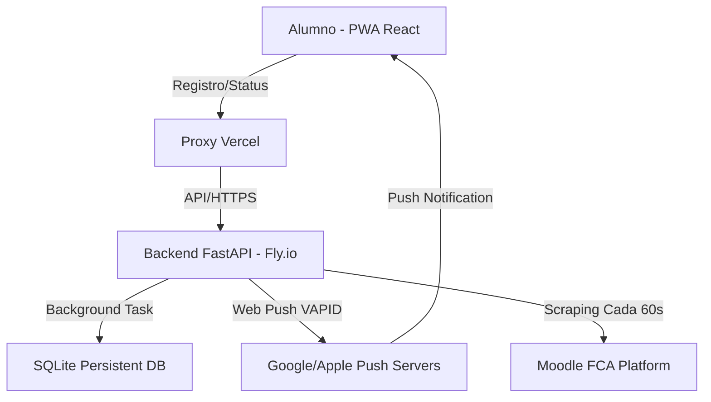

# 🎓 Moodle FCA Notifier PWA

[](https://fastapi.tiangolo.com/)
[](https://reactjs.org/)
[](https://vitejs.dev/)
[](https://tailwindcss.com/)
[](https://fly.io/)
[](https://vercel.com/)

> **Bot notificador de alto rendimiento para alumnos de la FCA UNAM.** Monitoreo en tiempo real, notificaciones nativas push y una experiencia de usuario premium diseñada para la productividad académica.

---

## 🌟 Características Principales

### 📱 Experiencia PWA (Progressive Web App)
- **Instalable:** Funciona como una aplicación nativa en iOS, Android y Desktop.
- **Offline Ready:** Navegación fluida incluso con conexión intermitente gracias a Service Workers.
- **Diseño Glassmorphism:** Interfaz moderna con efectos de desenfoque, gradientes vibrantes y micro-animaciones (Framer Motion).

### 🤖 Bot Inteligente de Monitoreo
- **Sincronización Real-Time:** Consulta las plataformas de **Contaduría, Administración e Informática** cada 60 segundos.
- **Notificaciones Segmentadas:** Detecta tareas nuevas, archivos subidos, mensajes directos y avisos generales.
- **Seguridad de Grado Bancario:** Encriptación Fernet (AES-128) para credenciales de usuario y tokens de acceso.

### 🛠️ Panel de Control Administrativo
- **Gestión de Usuarios:** Activación/Desactivación y monitoreo de dispositivos vinculados.
- **Broadcast Global:** Capacidad de enviar avisos masivos a todos los estudiantes registrados con un solo clic.
- **Diagnóstico Push:** Sistema de pruebas en tiempo real para verificar la entrega de notificaciones.

---

## 🏗️ Arquitectura del Sistema



### Stack Tecnológico
- **Frontend:** React 18, Vite, Tailwind CSS, Framer Motion, Lucide React.
- **Backend:** FastAPI, SQLAlchemy, PyWebPush, Cryptography (Fernet).
- **Infraestructura:** 
    - **Frontend:** Hosted en Vercel (Edge Network).
    - **Backend:** Hosted en Fly.io (Contenedores Docker con volúmenes persistentes).
    - **Base de Datos:** SQLite con persistencia en volumen dedicado.

---

## 🚀 Instalación y Desarrollo

### Requisitos
- Python 3.10+
- Node.js 18+
- Fly.io CLI (Para despliegue)

### Configuración Local

1. **Clonar el repositorio:**
   ```bash
   git clone https://github.com/xD4nEdu/moodle-fca-pwa.git
   cd moodle-fca-pwa
   ```

2. **Backend:**
   ```bash
   pip install -r requirements.txt
   # Configurar variables de entorno en .env
   python -m uvicorn app.pwa_server:app --port 9000 --reload
   ```

3. **Frontend:**
   ```bash
   cd frontend
   npm install
   npm run dev
   ```

---

## 📊 Impacto Académico
Este proyecto nace de la necesidad de los alumnos por mantenerse al día con el flujo constante de información académica. Al centralizar las notificaciones de las tres carreras principales de la FCA, reduce el "miedo a perderse de algo" (FOMO) y mejora los tiempos de entrega de los estudiantes.

---

## 📄 Licencia
Este proyecto es de uso personal y académico. Todos los derechos reservados a los desarrolladores.

---
*Desarrollado con ❤️ para la comunidad de la FCA UNAM.*
